<div align="center">



</div>

<br/>

<div align="center">


</div>

<br/>

```
╔══════════════════════════════════════════════════════════════════════╗
║                                                                      ║
║   $ whoami                                                           ║
║   ───────────────────────────────────────────────────────────────    ║
║                                                                      ║
║   name     →  teodor walter vido                                     ║
║   handle   →  baiehclaca / teodorwalterv                             ║
║   origin   →  slovakia, earth                                        ║
║   status   →  online · building · shipping                           ║
║                                                                      ║
║   $ cat /proc/compute                                                ║
║   ───────────────────────────────────────────────────────────────    ║
║                                                                      ║
║   ██████████████████████████████████████  1,000,000,000+ tkn/mo      ║
║                                                                      ║
║   tokens burned this month. above.                                   ║
║                                                                      ║
║   $ cat /etc/obsessions                                              ║
║   ───────────────────────────────────────────────────────────────    ║
║                                                                      ║
║   architecture · frameworks · protocols · systems design             ║
║   how things are built at the core — not just on top                 ║
║                                                                      ║
║   ♫  audio: always on                                                ║
║                                                                      ║
╚══════════════════════════════════════════════════════════════════════╝
```

<br/>

```
╔══════════════════════════════════════════════════════════════════════╗
║   $ ls /protocols --active --sort=ambition                           ║
╚══════════════════════════════════════════════════════════════════════╝
```

<br/>

<div align="center">

| ◈ | project | what it does |
|:---:|:---|:---|
| ◉ | **[Shadow-Twin Transformer](https://github.com/baiehclaca/shadow-twin-transformer)** | novel transformer architecture · dual coupled streams · confidence-aware generation |
| ◉ | **[Stratum](https://github.com/baiehclaca/stratum)** | proof-of-work algorithm · CPU mining revival · makes commodity hardware compete against ASICs |
| ◉ | **[Singular Company](https://github.com/singularqx)** | new way of computing |
| ◉ | **[open402](https://github.com/baiehclaca/open402)** | HTTP finally gets paid · open protocol + TypeScript SDK for HTTP 402 |
| ◉ | **[Service](https://github.com/baiehclaca/service)** | the only MCP server your AI agent needs · unified MCP hub & real-time notification gateway |
| ● | **[Veil Browser](https://github.com/cacodeAI/veil)** | headless browser CLI built for AI agents |
| ● | **[OpenClaw War-Room](https://github.com/baiehclaca/openclaw-warroom)** | terminal-first ops cockpit · task rooms · milestones · live coding feed |
| ● | **[Gula-Gug](https://github.com/baiehclaca/GULA-GUG)** | self-resolving terminal |
| ● | **[Caret-Translate](https://github.com/baiehclaca/caret-translate)** | double-tap TAB → translate any sentence · fully local · zero network |

</div>

<br/>

```
╔══════════════════════════════════════════════════════════════════════╗
║   $ lscpu --stack                                                    ║
╚══════════════════════════════════════════════════════════════════════╝
```

<br/>

<div align="center">


&nbsp;

&nbsp;

&nbsp;

&nbsp;

&nbsp;

&nbsp;


</div>

<br/>

```
╔══════════════════════════════════════════════════════════════════════╗
║   $ cat /proc/github-stats                                           ║
╚══════════════════════════════════════════════════════════════════════╝
```

<br/>

<div align="center">


&nbsp;&nbsp;


</div>

<br/>

<div align="center">


</div>

<br/>

```
╔══════════════════════════════════════════════════════════════════════╗
║   $ ping --social                                                    ║
╚══════════════════════════════════════════════════════════════════════╝
```

<br/>

<div align="center">

[github](https://github.com/baiehclaca) &nbsp;·&nbsp; [portfolio](https://teodorwaltervido.com) &nbsp;·&nbsp; [x](https://twitter.com/teodorwalterv) &nbsp;·&nbsp; [email](mailto:hi@teodorwaltervido.com)

</div>

<br/>

<div align="center">

```
  > always building. always iterating. always shipping.
```

</div>
